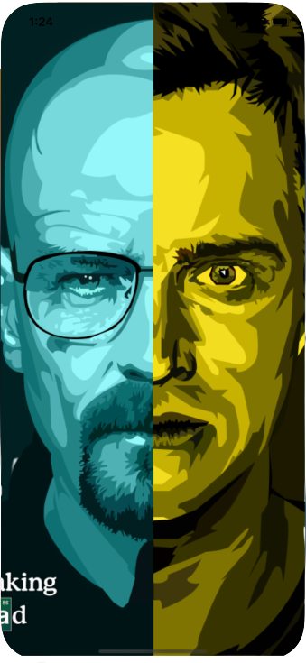
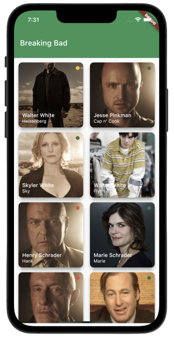

# Flutter - Breaking Bad

Hello everyone, I wanted to do a project in my flutter adventure that I just started learning. I created a project with the Breaking Bad api, which is offered to us developers for free.

## Features

- Listing the characters

## Goals

- [x] Splash screen
- [ ] Character search
- [ ] Character detail

## Packages  
- Dio

## Screens
|   |  |
| :---:   | :-: | 
| Splash |  |
| Home |   |
